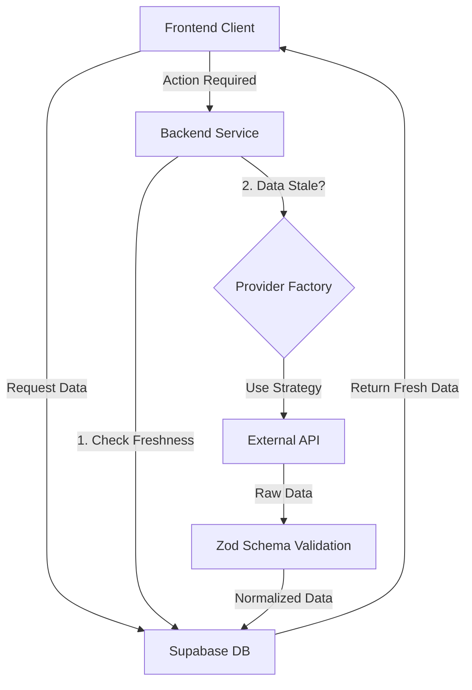

# Backend Architecture & Design

This document outlines the architectural decisions for the Football Betting App backend.

## 1. Core Principles
- **Persistance Layer**: Supabase (PostgreSQL) is the single source of truth.
- **Service Layer**: Stateless Node.js/TypeScript logic handles business rules and external data fetching.
- **Repair-on-Read**: Data is not synced via cron jobs alone. When data is requested, we check its freshness. If stale, we fetch from the source, update the DB, and then return.
- **Extensibility**: The **Factory Pattern** is used for API providers, allowing us to switch between data sources (e.g., API-Football, SportMonks, Mock) via configuration.

## 2. System Overview



## 3. Database Schema (Supabase)

### `profiles`
- Extended user data linked to `auth.users`.
- Trigger-based creation on sign-up.

### `matches`
- Stores fixture information.
- **Key Columns**:
    - `id`: UUID (Primary Key)
    - `external_id`: String (Provider's ID)
    - `last_updated_at`: Timestamp (Crucial for Repair-on-Read)
    - `status`: Scheduled, Live, Finished
    - `raw_data`: JSONB (Debugging/Auditing)

### `picks`
- Stores user bets.
- Linked to `profiles.id` and `matches.id`.

## 4. Provider Layer (Factory Pattern)

We define a common interface `ISportsProvider`. All implementations must adhere to this contract.

```typescript
interface ISportsProvider {
  getFixtures(date: string): Promise<ExternalMatch[]>;
  getOdds(matchId: string): Promise<ExternalOdds>;
}
```

**Factory Logic:**
- Checks `process.env.ACTIVE_PROVIDER`.
- Returns instance of `MockProvider` or `ApiFootballProvider`.

## 5. Validation (Zod)

We strictly validate all external data before it enters our system to prevent corruption.

```typescript
const ExternalMatchSchema = z.object({
  fixture: z.object({
    id: z.number(),
    date: z.string().datetime(),
    status: z.object({ short: z.string() })
  }),
  teams: z.object({
    home: z.object({ name: z.string() }),
    away: z.object({ name: z.string() })
  })
});
```

## 6. Repair-on-Read Logic

**Algorithm:**
1. User requests "Matches for Today".
2. Service queries DB: `SELECT * FROM matches WHERE date = TODAY`.
3. If `count == 0` OR `(NOW() - matches[0].last_updated_at) > THRESHOLD`:
    - Call `Provider.getFixtures(TODAY)`.
    - Loop through results -> Validate -> `upsert` to DB.
4. Return updated list from DB.
